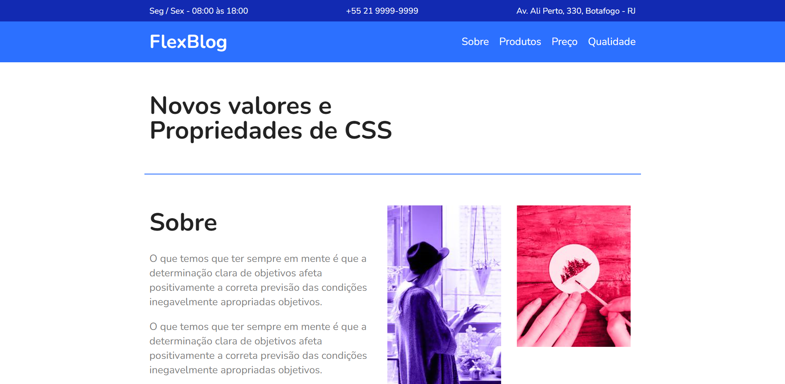

<h1 align="center">
 
FlexBlog
</h1>

FlexBlog é uma página web simples feita em HTML e CSS para por em prática estudos aprofundados de flexbox. 

Acesse a página [aqui](https://flexblog-seven.vercel.app/)

## :computer: Desktop
 
 

## :iphone: Mobile
 
